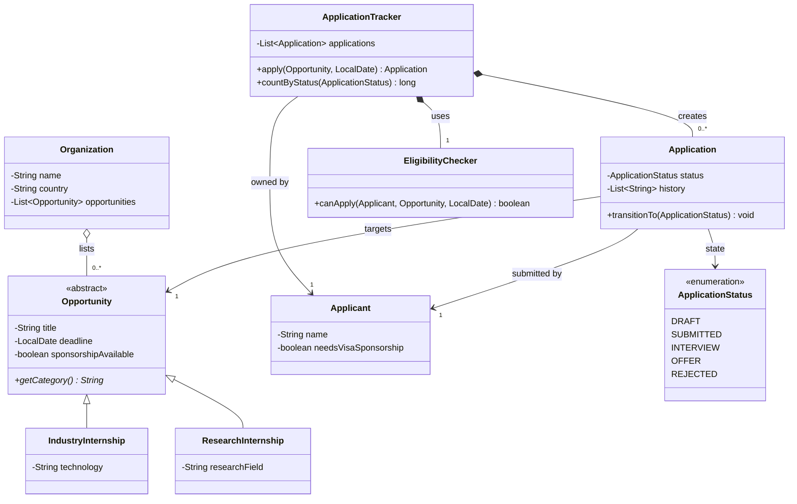

# UML Class Diagram

```mermaid
classDiagram
    class Opportunity {
      <<abstract>>
      -String title
      -LocalDate deadline
      -boolean sponsorshipAvailable
      +getCategory() String*
    }
    class IndustryInternship { -String technology }
    class ResearchInternship { -String researchField }
    class Applicant { -String name
      -boolean needsVisaSponsorship }
    class Organization { -String name
      -String country
      -List~Opportunity~ opportunities }
    class Application { -ApplicationStatus status
      -List~String~ history
      +transitionTo(ApplicationStatus) void }
    class ApplicationTracker { -List~Application~ applications
      +apply(Opportunity, LocalDate) Application
      +countByStatus(ApplicationStatus) long }
    class EligibilityChecker { +canApply(Applicant, Opportunity, LocalDate) boolean }
    class ApplicationStatus { <<enumeration>>
      DRAFT
      SUBMITTED
      INTERVIEW
      OFFER
      REJECTED }
    Opportunity <|-- IndustryInternship
    Opportunity <|-- ResearchInternship
    Organization o-- "0..*" Opportunity : lists
    ApplicationTracker *-- "0..*" Application : creates
    ApplicationTracker --> "1" Applicant : owned by
    ApplicationTracker *-- "1" EligibilityChecker : uses
    Application --> "1" Opportunity : targets
    Application --> "1" Applicant : submitted by
    Application --> ApplicationStatus : state
```
